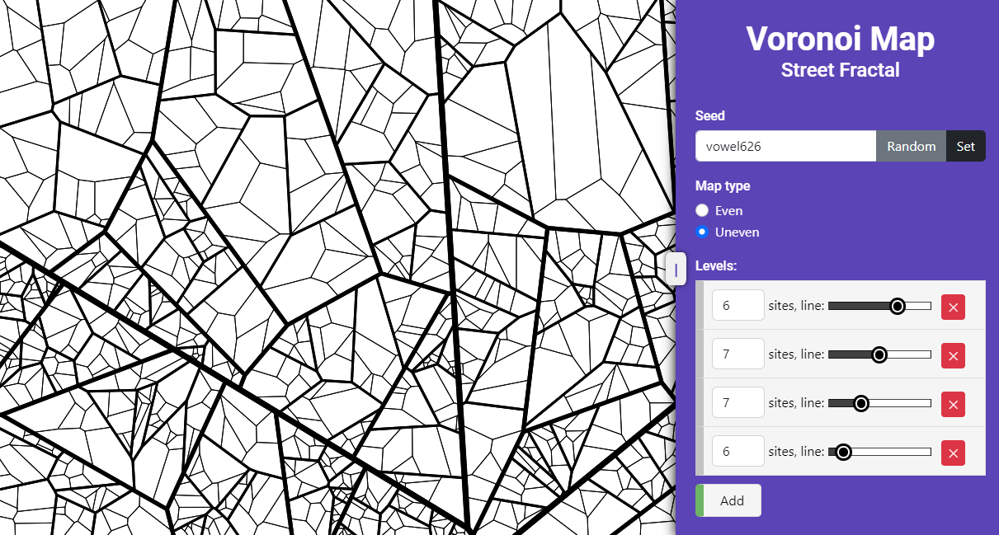
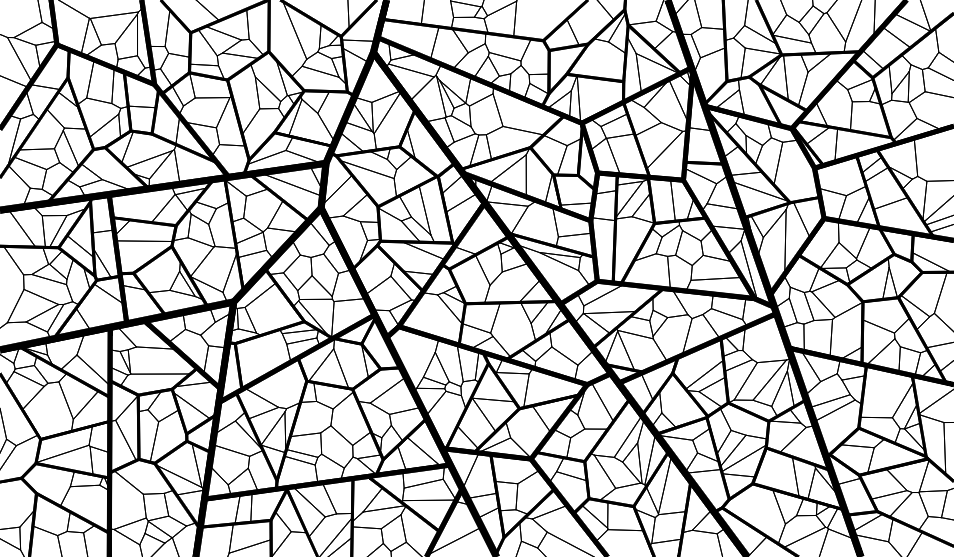
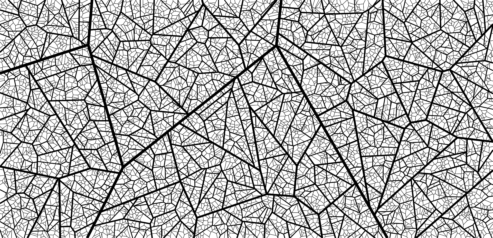

## Voronoi Street Map Generator

### Popis

Toto je webová stránka, která používá Voroného diagramy k rekurzivnímu generování mapy ulic. \
Mapa připomíná starší evropská města s množstvím úzkých ulic a trojúhelníkových bloků. \
Uživatel může nastavit počet úrovní ulic, počet bloků a podobu ulic. \
Mapu lze stáhnout jako obrázek PNG.

### Jak používat

Stačí otevřít soubor `index.html` v prohlížeči. Skripty používají CDN k načtení knihoven. \
Další možností je live verze na [GitHub Pages](https://leirimnad.github.io/voronoi-street-map/).

### Jak to funguje

Algoritmus je založen na [Voroného diagramu](https://cs.wikipedia.org/wiki/Voron%C3%A9ho%20diagram). \
Diagramy jsou generovány pomocí knihovny [d3-delaunay](https://github.com/d3/d3-delaunay) prostřednictvím generování
odpovídajících Delaunayových triangulací.

První úroveň diagramu rozdělí plátno na několik buněk pomocí náhodně vygenerovaných míst (_sites_). \
Poté každý z nově vygenerovaných polygonů získá sadu náhodných míst, která se použijí k vygenerování další úrovně diagramu.

Vzhledem k omezením `d3-delaunay` lze diagram vytvořit pouze na obdélnících,
takže zatímco místa jsou generována uvnitř polygonu, diagram je sestaven na ohraničujícím boxu polygonu. \
Poté je diagram oříznut na tvar polygonu pomocí
[Sutherlandova-Hodgmanova algoritmu ořezávání polygonů](https://en.wikipedia.org/wiki/Sutherland%E2%80%93Hodgman_algorithm).

Uživatel si může vybrat typ mapy: **uneven** (nerovnoměrný) nebo **even** (rovnoměrný), který ovlivňuje způsob rozložení míst. \
Typ mapy **uneven** generuje stejné množství míst pro každý polygon. \
Typ mapy **even** rozděluje celé množství míst na základě plochy každého z polygonů. 

### Příklady

  
Even map

  
Uneven map

  
Další příklady

Vyzkoušejte si to sami: [GitHub Pages](https://leirimnad.github.io/voronoi-street-map/)

### Myšlenky na zlepšení aplikace

Ke zlepšení aplikace lze přidat například následující:

- V aplikaci je možné použít nekonečný typ mapy s dynamicky generovanými diagramy.
- Jiné rozložení míst, například generování více míst ke středu mapy.
- Různé typy ulic a dalších součástí mapy (budovy, parky atd.).
- Použití _sites_ ke generování zajímavých míst na mapě
- Manipulace s tvarem ulic, například jejich zakřivení
- Zlepšení výkonu aplikace

Několik z těchto nápadů je částečně implementováno v dalších větvích, ale problémy s výkonem
vyžadují další vylepšení algoritmů.

### Licence

Tento projekt je licencován pod licencí WTFPL. Podrobnosti naleznete v souboru [LICENSE.txt](LICENSE.txt).