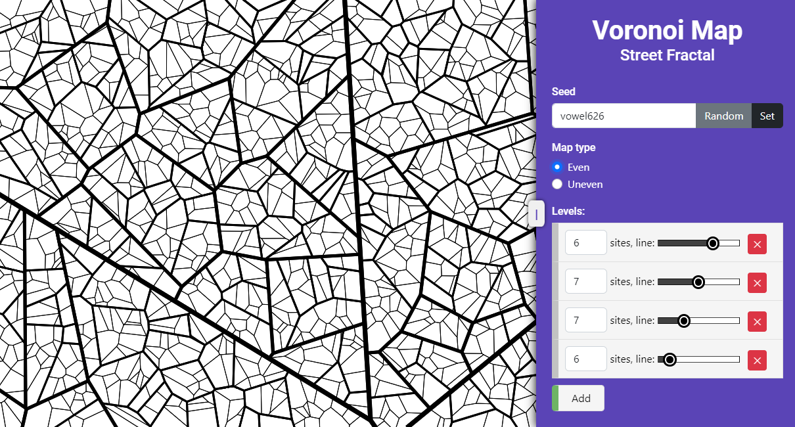
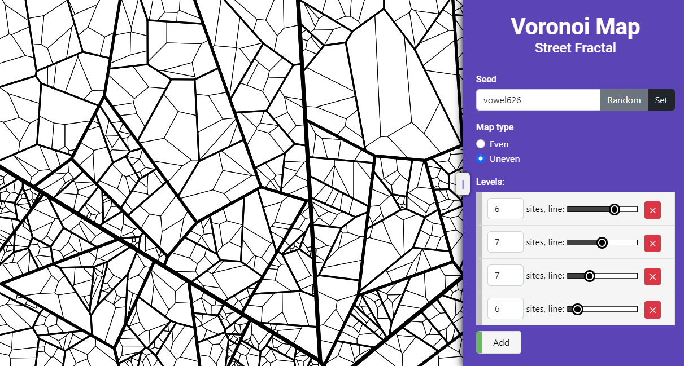
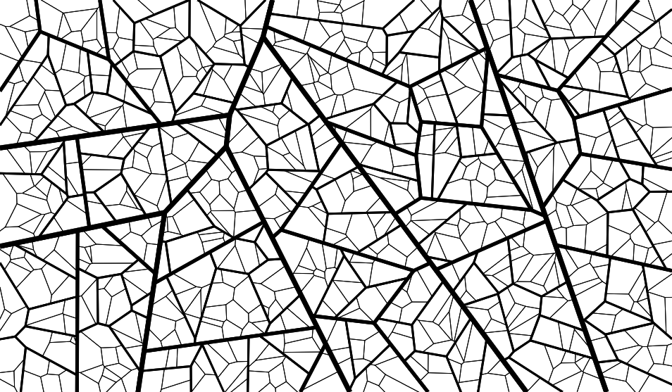
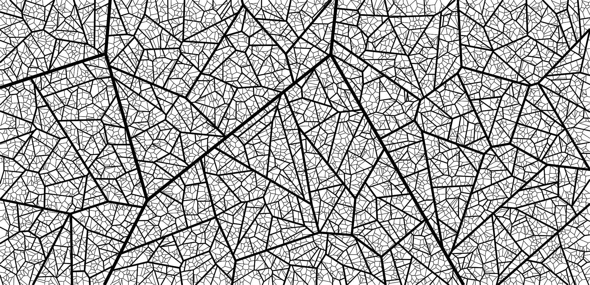

## Voronoi Street Map Generator

### Description

This is a webpage that uses Voronoi diagrams to recursively to generate a street map. \
The map resembles older European cities, with a lot of narrow streets and triangular blocks. \
User can adjust the number of street levels, the number of sites, and the look of the street. \
The map can be downloaded as a PNG image.

### How to use

It is enough to open the `index.html` file in a browser. The scripts use CDN to load the libraries. \
Another option is a live version on [GitHub Pages](https://leirimnad.github.io/voronoi-street-map/).

### How it works

The algorithm is based on the [Voronoi diagram](https://en.wikipedia.org/wiki/Voronoi_diagram). \
The Voronoi diagrams are generated using the [d3-delaunay](https://github.com/d3/d3-delaunay) library via generating 
the corresponding Delaunay triangulations. 

First level of the diagram splits the canvas into a number of cells using randomly generated _sites_. \
Then, each of the newly generated polygons gets a set of random sites, which are used to generate the next 
level of the diagram. 

Due to the restrictions of `d3-delaunay`, the diagram can be built only on rectangles, 
so while the sites are generated inside the polygon, the diagram is built on a polygon's bounding box. \
Then, the diagram is clipped to the polygon's shape using 
the [Sutherland-Hodgman polygon clipping algorithm](https://en.wikipedia.org/wiki/Sutherland%E2%80%93Hodgman_algorithm).

User can choose the map type: **uneven** or **even**, which affects the way sites are distributed. \
The **uneven** map type generates the equal amount of sites for each polygon. \
The **even** map type distributes the whole amount of sites per level based on each of the polygons' area. 

### Examples

  
Even map

  
Uneven map

  
Other examples

Try it yourself: [GitHub Pages](https://leirimnad.github.io/voronoi-street-map/)

### Thoughts on improving the app

The following can be added to improve the app:

- An infinite map type, with diagrams dynamically generated on the fly as the user scrolls the map
- Other distributions of sites, for example, generating more sites towards the center of the map
- Different types of streets, other map elements (buildings, parks, etc.)
- Using sites to generate points of interest on the map
- Manipulating with the streets' shape, for example, making them curved
- Improving the performance of the app

Several of those ideas are partially implemented in the other branches, but the performance issues
require a deeper dive into improving the algorithms.

### License

This project is licensed under the WTFPL license. See the [LICENSE.txt](LICENSE.txt) file for details.